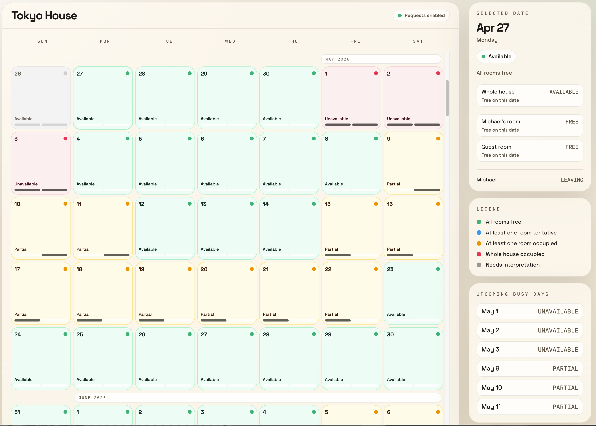

# house-calendar

`house-calendar` turns private house calendars into redacted, shareable availability.

It is built for the case where you want trusted people to know whether a room or house is free without exposing raw event titles, guest names, or your full personal calendar. The product is meant to stay lightweight: it helps people coordinate stays, but it is not a booking marketplace and not a public calendar mirror.

## What It Does

- Imports private calendar data and interprets it into typed internal facts
- Derives room and whole-house availability instead of rendering raw calendar events
- Surfaces short same-day timed notes alongside availability when the owner adds them to the source calendar
- Redacts guest details and only shows housemate presence when configured explicitly
- Supports one deployment with multiple houses, each with its own branding and parsing rules
- Lets trusted viewers make lightweight stay requests without turning requests into automatic holds
- Gives the owner a small self-hosted admin flow with password-based access and manual sync controls

## Docs

- [DEVELOPMENT.md](./DEVELOPMENT.md) for setup, local workflow, commands, and admin bootstrap
- [DEPLOYMENT.md](./DEPLOYMENT.md) for provider-agnostic deployment requirements and config/env setup
- [CONTRIBUTING.md](./CONTRIBUTING.md) for contribution expectations and review guardrails
- [ARCHITECTURE.md](./ARCHITECTURE.md) for system boundaries, data flow, privacy model, and technical direction
- [AGENTS.md](./AGENTS.md) for project-specific agent instructions
- [config/config.example.json](./config/config.example.json) for the checked-in config shape

## Quickstart

1. Install dependencies with `bun install`
2. Start Postgres with `bun run db:start`
3. Optionally copy `config/config.example.json` to `config/config.json` for private local overrides
4. Start the app with `bun dev`
5. Run `bun run ports` to see the worktree-specific local URL

Full setup, config, and day-to-day development commands live in [DEVELOPMENT.md](./DEVELOPMENT.md).

## Creating Calendar Events

Use your source calendar as the authoring surface. The app interprets those
events into availability and a small amount of redacted viewer-facing context.

- Use all-day events for stays and occupancy, such as `Someone stays (guest room)` or `Someone stays (whole house)`.
- Use `maybe stay` or `(tentative)` in the title when the stay is not confirmed yet.
- Use the configured housemate shorthand for presence and travel, such as `Michael (TPE)` or `Michael in Tokyo (not staying)`.
- Use short timed events for same-day logistics you want viewers to see, such as `Cleaner 1pm-3:30pm JST`.

Timed event titles are shown to viewers as written. Keep them short and
intentionally shareable.

If you want more control, each site can configure timed notes under
`calendarDisplay.timedNotes` in config:

- `enabled` turns viewer-facing timed notes on or off.
- `showTime` controls whether the calendar UI shows the event time range.
- `textSource` chooses whether the note uses the event `title`, the event description, or `title_then_description`.

## Privacy Rules For Events

- Overnight stays and presence updates shape the calendar status, but viewers do not see those source events listed back as raw calendar entries.
- Short timed events can appear in the calendar UI as simple day notes on the matching date.
- If you mark a timed event as private or confidential in your calendar app, it will be hidden from viewers.
- Hidden timed events also do not change the room or whole-house availability shown in the UI.
- If a timed note will be visible to viewers, write it the way you want it to appear in the calendar UI.
